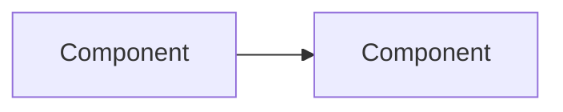

## What

<!-- One-line: what does this PR do? -->

## Why

<!-- Problem being solved, motivation, link to issue if any -->

## Architecture

<!-- Delete this section if no structural changes.
     Use mermaid diagrams for data flow, component relationships, or service boundaries.

-->

## Changes

<!-- Group by concern, not by file. Examples:
     **API layer** — added /foo endpoint, updated auth middleware
     **Database** — new migration for X table
     **Config** — updated env vars, added feature flag -->

## Breaking changes

<!-- Migration steps if any. Delete section if none. -->

## Test plan

<!-- How was this verified? What should a reviewer test? -->

## Visual

<!-- Before/after screenshots, recordings, or terminal output. Delete if N/A. -->
